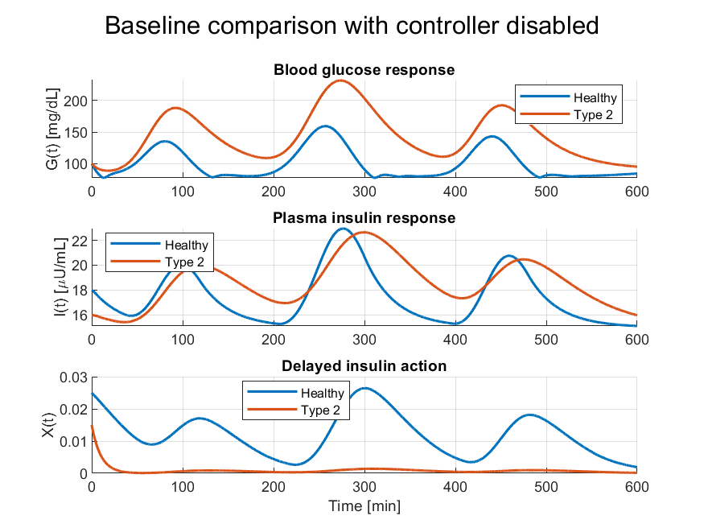
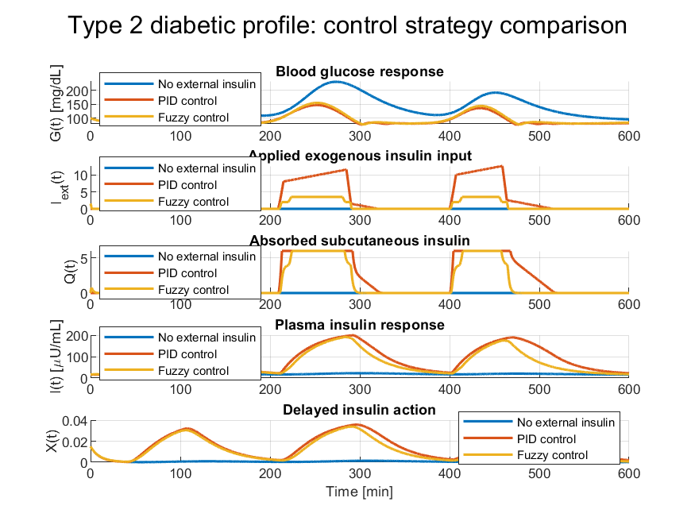

# Glucose–Insulin Dynamics Modelling and Control in Simulink

Academic MATLAB/Simulink project on glucose–insulin dynamics modelling and control using an extended Bergman-based model.

This repository documents a simplified biomedical control-system workflow developed for academic and portfolio purposes. It is intended as a technical example in biomedical modelling, simulation and control.

> **Disclaimer:** this is an academic modelling project. It is not a clinical model, not a medical device algorithm and it is not intended for therapeutic decision-making.

## Project scope

The Simulink model explores glucose–insulin regulation under different simulated patient profiles and control strategies:

* healthy subject profile;
* type 1 diabetic profile;
* type 2 diabetic / insulin-resistant profile;
* meal intake simulation;
* external insulin input;
* subcutaneous insulin absorption dynamics;
* PID-based control;
* fuzzy-logic-based control.

The model is based on a Bergman-style glucose–insulin framework with academic extensions for meal input, exogenous insulin absorption and counter-regulatory behaviour.

## Repository structure

```text
model/
  bergman_model.slx
  fuzzy_diabete.fis

data/
  pasto.mat

scripts/
  inspect_model_selectors.m
  run_healthy_vs_type2_baseline.m
  run_control_strategy_comparison.m
  run_baseline_patient_profiles.m
  run_all_scenarios.m
  configure_bergman_model.m
  configure_portfolio_output_probes.m
  find_block_by_display_name.m
  extract_sim_signal.m

figures/
  healthy_vs_type2_baseline.png
  type2_control_strategy_comparison.png

docs/
  model_configuration.md
  project_summary.md
```

## Main scripts

Run the following scripts from the repository root in MATLAB:

```matlab
run('scripts/inspect_model_selectors.m')
run('scripts/run_healthy_vs_type2_baseline.m')
run('scripts/run_control_strategy_comparison.m')
```

`inspect_model_selectors.m` checks that the scripts can find the intended Simulink selector blocks. It does not add temporary probes and does not modify the model.

`run_healthy_vs_type2_baseline.m` compares healthy and type 2 profiles with external insulin/control disabled.

`run_control_strategy_comparison.m` compares, for the type 2 profile, three scenarios:

* no external insulin;
* PID control;
* fuzzy control.

The control-comparison script plots blood glucose `G(t)`, applied exogenous insulin input `I_ext_applied`, absorbed subcutaneous insulin `Q_absorbed`, plasma insulin `I(t)` and delayed insulin action `X(t)`.

## Optional script

The script below can also be run to include the uncontrolled type 1 profile:

```matlab
run('scripts/run_baseline_patient_profiles.m')
```

This optional comparison includes healthy, type 1 and type 2 profiles with external insulin/control disabled. The uncontrolled type 1 profile is expected to produce very high glucose values in this simplified academic model, so it is not used as the main portfolio figure.

## Example results

The main portfolio figures are stored in the `figures/` folder and are shown below.

### Healthy vs Type 2 baseline

The baseline comparison shows the difference between a healthy profile and a type 2 diabetic / insulin-resistant profile with external insulin disabled.



In the tested configuration:

* the healthy profile reached a peak glucose value of approximately **159 mg/dL**;
* the type 2 profile reached a peak glucose value of approximately **232 mg/dL**;
* the type 2 profile showed a higher mean glucose level across the simulation.

### Type 2 control strategy comparison

For the type 2 profile, PID and fuzzy control both reduced postprandial glucose peaks compared with the no-control condition.



In the tested configuration:

* no external insulin reached a peak glucose value of approximately **232 mg/dL**;
* PID control reduced the peak glucose value to approximately **147 mg/dL**;
* fuzzy control reduced the peak glucose value to approximately **155 mg/dL**;
* the fuzzy controller achieved a comparable glucose response with a lower peak applied insulin command than the PID controller.

These results are configuration-dependent and should be interpreted only as outputs of a simplified academic simulation model.

## Important signal-logging note

The original Simulink model contains both controller-internal signals and model-level selected signals. For the portfolio figures, the scripts log:

* `I_ext_applied`: the exogenous insulin input after the model-level selector and after the pathological-profile gate;
* `Q_absorbed`: the output of the subcutaneous insulin absorption subsystem `Q(t)`.

This ensures that the plotted insulin input corresponds to the input actually delivered to the physiological absorption block in each simulated scenario.

The resulting interpretation chain is:

```text
control strategy → applied I_ext(t) → absorbed Q(t) → plasma I(t) → delayed insulin action X(t) → glucose G(t)
```

## Requirements

The project requires MATLAB and Simulink.

The fuzzy-control configuration uses a `.fis` file, so MATLAB installations with Fuzzy Logic Toolbox support are recommended for full functionality.

The scripts were developed and tested in an academic MATLAB/Simulink environment. Different MATLAB releases may require minor adjustments in Simulink model handling.

## How to reproduce the main figures

From the repository root, run:

```matlab
run('scripts/run_all_scenarios.m')
```

This runs the selector inspection and generates the two main portfolio figures:

```text
figures/healthy_vs_type2_baseline.png
figures/type2_control_strategy_comparison.png
```

Alternatively, run the scripts individually:

```matlab
run('scripts/inspect_model_selectors.m')
run('scripts/run_healthy_vs_type2_baseline.m')
run('scripts/run_control_strategy_comparison.m')
```

The scripts reload the Simulink model before adding temporary plotting probes. If MATLAB asks whether to save changes to the Simulink model after running the scripts, the model can be closed without saving.

## Documentation

Additional notes are provided in:

* `docs/model_configuration.md`: selector values, signal-logging strategy and model configuration notes;
* `docs/project_summary.md`: short technical summary of the academic modelling workflow.

## Author

**Luca Serioli**<br>
Biomedical Engineer<br>
